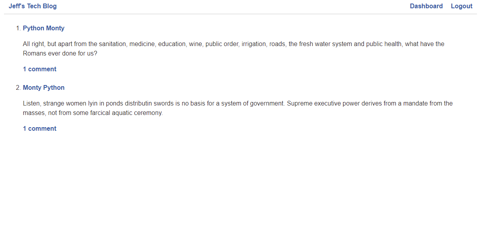
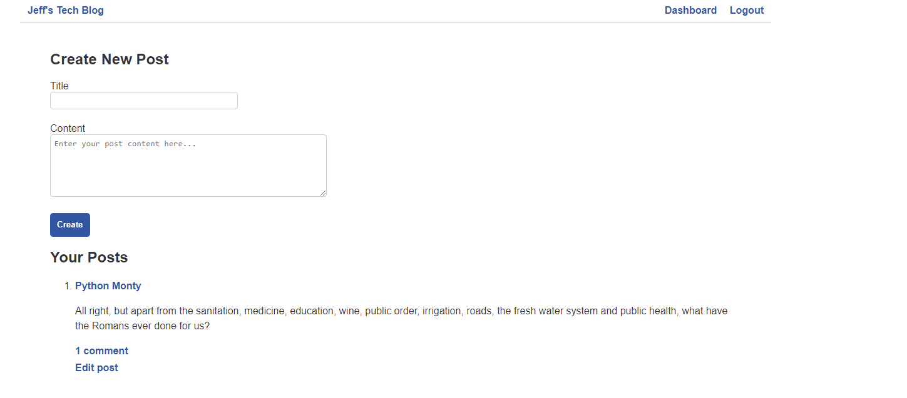
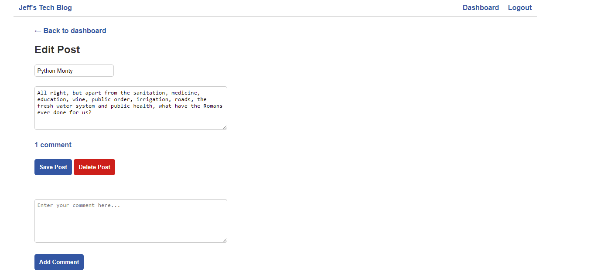

# Jeff's Tech Blog

## Heroku Deployment
https://intense-coast-68796.herokuapp.com/

## Description
The purpose of this project was to create a CMS style tech blogging website. Once users have created an account, they can add articles and blog posts to the website. They are also able to add comments to posts that other people make.

## Table Of Contents
* [Description](#description)
* [Installation](#installation)
* [Usage](#usage)
* [Contributing](#contributing)
* [Tests](#tests)
* [Credit](#credit)
* [Questions](#questions)
* [License](#license)

## Installation
Please use the following console command to install project dependancies: npm install

## Usage
Please use this project for all of your tech blogging needs.

## Contributing
Please reach out to me through email if you'd like to contribute to this project

## Tests
There are no tests for this project.

## Credit
Created By: Jeffrey Brittingham  
Creator Github Profile: https://github.com/JBGinger

## Screenshots

### Homepage:

### Dashboard:

### Edit Post:

## Questions
Have any questions about this project? Please send me an email at jeff.brittingham@protonmail.com.
Feel free to take a look at this project's Github repository (along with my other work) on my Github profile: https://github.com/JBGinger.

## License 
  Licensed Under: None  
  License Link: None